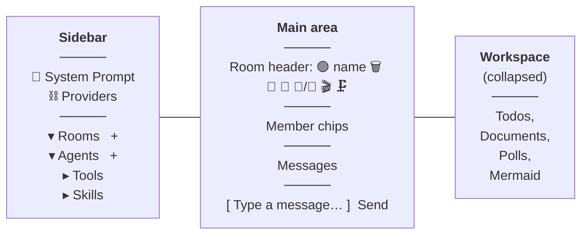
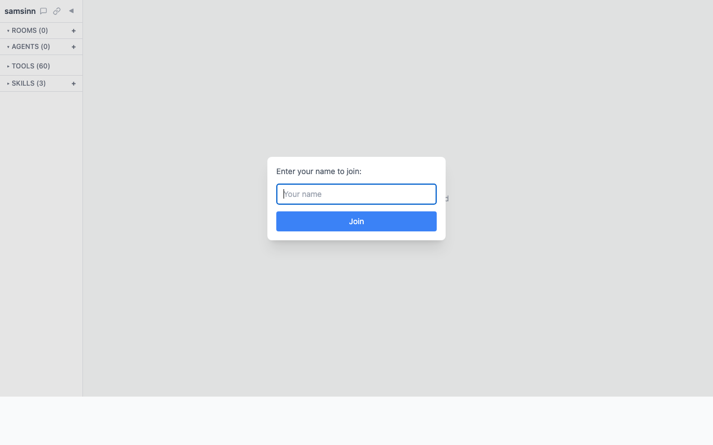

# Getting Started with Samsinn

You opened http://localhost:3000, entered your name, and you're staring at an empty screen that says *"Create a room to get started."* Now what?

This guide takes you from that empty screen to running a three-agent pipeline in under 20 minutes. It covers the UI you'll actually use, and three short missions that each introduce one new idea. Skim the tour, then work through the missions in order — each one builds on the last.

> **Prerequisite.** Samsinn is installed and running, and at least one LLM provider is configured. If the **⛓ Providers** button in the top-left shows a red dot, open it and add either an Ollama URL or a cloud API key (Anthropic, OpenAI, Groq, Gemini, …) before continuing.

---

## The 60-second tour

Samsinn has three regions and you'll spend 95% of your time in the middle one:

**Sidebar (left).** Lists your rooms, agents, installed tools, and skills. The `+` next to **Rooms** and **Agents** is how you create things. At the top: **💬** opens a global system prompt shared by all agents; **⛓** opens the Providers panel (models, API keys, health). `◀` collapses the sidebar.

**Main area (center).** When no room is selected, shows the empty state. Once you pick a room, this area becomes the chat: a header full of icons, a strip of member chips, the message log, and an input box.

**Workspace (bottom, collapsible).** Per-room artifacts: **task lists** (todos), **documents**, **polls**, and **mermaid** diagrams. Click **▲ Workspace** to open it. You'll meet this in Mission 2.

That's it. Four sidebar buttons and a message box are all you need to start.

---

## Mission 1 · Two minds

**Goal:** get two AI agents to have a conversation with you, and learn how to address just one of them.

**Why this mission:** it's the whole premise of Samsinn in five minutes — multiple agents sharing a room, each with their own perspective, with you steering.

### Steps

1. **Create your first agent.** Click **+** next to **Agents** in the sidebar.
   - **Name:** `Skeptic`
   - **Model:** pick any model from the dropdown. If you don't see one you like, tick *"Show all models"* or open **⛓ Providers** to enable more.
   - **Persona:** `You are a skeptic. You question assumptions and point out flaws. Keep replies short (1–3 sentences).`
   - Click **Create**.

2. **Create a second agent.** Same flow, but:
   - **Name:** `Optimist`
   - **Persona:** `You are an optimist. You see possibilities and build on ideas. Keep replies short (1–3 sentences).`

3. **Create a room.** Click **+** next to **Rooms**.
   - **Name:** `debate`
   - Leave the room prompt blank for now.

4. **Add members.** Click the room to open it. You'll see a row of member chips under the header with a `+` at the end. Add **yourself**, then **Skeptic**, then **Optimist**.

5. **Talk.** Type: `Should we ship software on Fridays?` and hit Send.

Both agents will reply. Watch the pulsing dots on their chips — that's "generating" — and the model badge that appears on each message once it arrives.

### Try this

- **Directed addressing.** Type `[[Skeptic]] what's the worst case?` Only Skeptic replies, even though Optimist is still in the room. The `[[Name]]` prefix overrides the default "everyone hears everything" broadcast.
- **Mute.** Click the green dot on Optimist's chip — it goes grey. Now Optimist is muted *in this room* (still a member, still everywhere else). Click again to unmute.
- **Remove.** Hover a member chip to reveal **×**. That removes them from the room without deleting the agent.

### What you just learned

| Concept | You saw it as… |
|---|---|
| **Agent** | `Skeptic`, `Optimist` — a name + a model + a persona |
| **Room** | `debate` — a shared space with an explicit member list |
| **Broadcast delivery** | Both agents replied to your message |
| **Directed addressing** | `[[Skeptic]]` routed only to Skeptic |
| **Per-room mute** | The grey dot — silences one agent in one room |

---

## Mission 2 · Give them work

**Goal:** use the shared todo list so your agents can track and complete work across turns.

**Why this mission:** one-off replies are fun; *durable state* is what makes Samsinn useful. Every room has a todo list agents can see and modify.

### Steps

1. **Open the workspace.** At the bottom of the room, click **▲ Workspace**. A pane opens. At the top of the pane, pick **Task List** from the dropdown, type a title (e.g. `ship checklist`), and click **Add**. An empty task list appears.

2. **Give an agent the tools.** Click `Skeptic` in the sidebar to open the inspector. Scroll to the tools section and enable at least: `list_todos`, `add_todo`, `update_todo`. Save. Do the same for `Optimist`.

3. **Back to the room.** Type:
   > `[[Skeptic]] Add 3 todos for things to check before shipping a release. Use the add_todo tool.`

   You'll see Skeptic think for a moment, then the workspace task list fills in with new rows — Skeptic called `add_todo` three times. The tool calls are hidden from chat; you only see the final reply.

4. **Get one done.** Type:
   > `[[Optimist]] Pick one todo from the list, mark it in_progress, then record a short result and mark it completed.`

   Watch the task list update in real time.

### Try this

- **Hover a todo row** to see assignee, status dot, and the recorded result (if any).
- **Click the `📋` badge on any message** to open the *context inspector* — this is exactly what the agent saw before replying, including the todo list. Great for debugging "why did the agent do that?"
- **Type a todo manually** in the workspace — agents see human-created todos too.

### What you just learned

| Concept | You saw it as… |
|---|---|
| **Artifacts** | The workspace pane; task lists are one artifact type |
| **Tools** | Enabled per-agent in the inspector; invoked invisibly during a reply |
| **Shared state** | Todos persist across turns and are visible to everyone in the room |
| **Context inspector (📋)** | The "what did the agent see?" reveal |

---

## Mission 3 · Orchestrate a pipeline

**Goal:** build a **macro** — an ordered sequence of agents that each take exactly one turn, passing output forward.

**Why this mission:** this is the payoff. One trigger message runs a whole Researcher → Analyst → Writer pipeline, with each agent seeing the previous one's output.

### Steps

1. **Create a third agent.** Same **+ Agent** flow:
   - **Name:** `Writer`
   - **Persona:** `You write crisp summaries. Given a debate between a Skeptic and an Optimist, produce a 3-bullet takeaway.`

2. **Add `Writer` to the `debate` room** via the `+` on the member chip row.

3. **Open the macro editor.** In the room header, click **🎬**. A popover opens with macro controls. Click **＋** *Create new macro*.
   - **Name:** `takeaway`
   - **Steps:** pick `Skeptic`, then `Optimist`, then `Writer` in that order.
   - Leave step prompts blank (you can add per-step instructions later).
   - Save.

4. **Select it.** Click **📋** in the same macro group and pick `takeaway`.

5. **Trigger it.** Type any message — e.g. `Topic: should we freeze hiring next quarter?` — and hit Send.

You'll see the **running macro chip** appear in the room header (`▶ takeaway — step 1/3`). Skeptic replies, then the chip advances to `step 2/3` and Optimist replies, then Writer posts the 3-bullet takeaway. Each agent sees everything the previous steps produced.

### Try this

- **Stop mid-run** with the **⏹** on the macro chip.
- **Loop a macro** by editing it and enabling loop — great for iterative refinement (A drafts, B critiques, A revises, …).
- **Add a step prompt** (e.g. on the Writer step: `Respond only with bullets, no preamble`) — it's injected only while that step runs.

### What you just learned

| Concept | You saw it as… |
|---|---|
| **Macro** | `takeaway` — an ordered list of agents |
| **Macro mode** | Running chip in the header; agents spoke one at a time in order |
| **Step prompt** | Scoped extra instructions per agent, per macro |

---

## UI reference (the rest of the icons)

You now know the core flow. Here's what everything else in the UI does — skim, bookmark for later.

### Room header icons

| Icon | What it does |
|---|---|
| 🟢 / 🔴 | **Pause dot** — click to pause/resume all message delivery in the room |
| 🗑 | **Clear messages** — wipes chat, agent memory, and summary state for this room |
| 🔖 | **Bookmarks** — opens the bookmark list; any saved message can be re-sent with one click |
| 💬 | **Room prompt** — instructions every agent in this room gets in their context |
| 📣 / 👋 | **Delivery mode** — Broadcast (default) vs. Manual (agents wake only when you click ▶ on their chip) |
| 🎬 | **Macro group** — expands to 📋 select, ➤ next step, ＋ create |
| 🗜 | **Summary / compression** — expands to ⚙ settings, 🔍 inspect, ↻ regenerate. Keeps long conversations fitting in context |

### Sidebar

| Icon | What it does |
|---|---|
| 💬 (top-left) | **System prompt** — global text prepended to every agent's context |
| ⛓ | **Providers panel** — Ollama URL, cloud API keys, model lists, health, per-provider tests |
| ▾ Rooms `+` | Your rooms; `+` creates one |
| ▾ Agents `+` | Your agents; `+` creates one. Click an agent to open its inspector |
| ▸ Tools | Every tool loaded at startup (built-in + `./tools/` + `~/.samsinn/tools/`) |
| ▸ Skills `+` | Behavioral templates. Agents can also create new ones at runtime |
| ◀ | Collapse sidebar |

### Per-message controls (hover to reveal)

| Icon | What it does |
|---|---|
| Model badge | Which model produced this message (always visible) |
| Context badge `T/M pct%` | Tokens used / max for this generation |
| 📋 | **Context inspector** — open the exact prompt the agent received |
| 🔖 | **Bookmark** — save this message's text for quick re-send |
| 📌 | **Pin** — keep it visible in a pinned bar at the top |
| ✕ | Delete this message |

### Member chips (the strip under the room header)

- **Colored dot** — green idle, yellow generating, grey muted. Click to toggle mute.
- **Hover ×** — remove from room.
- **▶** (manual mode only) — give this AI agent exactly one turn right now.

---

## Where to go next

- **Write your own tool.** [`docs/tools.md`](tools.md) — drop a `.ts` file in `./tools/`, and any agent that lists it gets the new capability.
- **Add an artifact type.** [`docs/artifact-modules.md`](artifact-modules.md) — the task-list / document / poll / mermaid system is pluggable.
- **Headless / MCP.** Run Samsinn as an MCP server so another LLM can orchestrate everything through 23 tools: `bun run headless`. See the README section on MCP integration.
- **REST + WebSocket API.** Everything the UI does is available as HTTP + WS — see the README for endpoints.

When something breaks or confuses you, the **📋 context inspector** on any message is almost always the fastest way to understand why. Start there.
